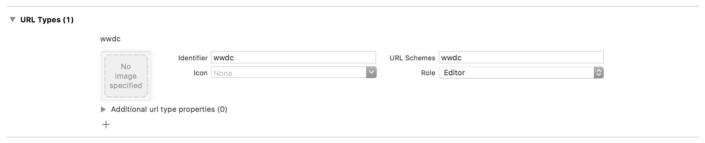

# WWDC 2017 Playground

## Open URL in Simulator

This shows how to open a URL in a simulator using the command line tool **simctl**.

### Find the identifier of the Simulator

You can find the correct identifier by using the simctl command `list`:

`kim$ xcrun simctl list`

```
-- iOS 11.0 --
    iPhone 5s (E7570A9E-C4E3-4205-ADE3-9F7D8E39C251) (Booted)
    iPhone 6 (EE45EC3A-809F-48AE-B416-941C227CE9BD) (Shutdown)
```

Alternatively the identifier can also be found in [Devices and Simulators](./Resources/devices_and_simulators.png).

### Register the Scheme

In the _Info_ tab of the target settings:



### Open the URL

- Run the example project
- Open the url using the `openurl` subcommand of **simctl**

Assuming the identifier of the simulator you launched the app in was `E7570A9E-C4E3-4205-ADE3-9F7D8E39C251`

`kim$ xcrun simctl openurl E7570A9E-C4E3-4205-ADE3-9F7D8E39C251 'wwdc://host/abc?a=1&b=2&c=3'`

This will yield the following in the console output as the open URL delegate method is implemented [in the app delegate](https://github.com/q231950/wwdc17/blob/master/wwdc/AppDelegate.swift#L47-L61):

```
Scheme:	wwdc
Host:	host
Path:	/abc
Query items:	[a=1, b=2, c=3]
```
